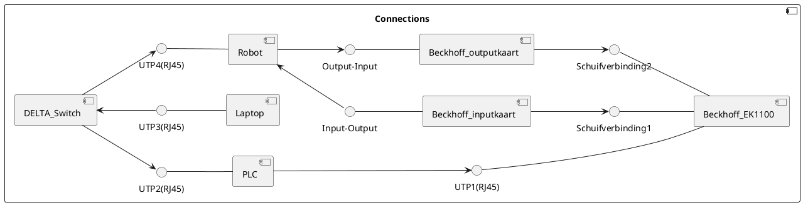

# Connections testplaat

```plantuml
@startuml conncections
skinparam backgroundColor transparent
left to right direction
'skinparam linetype ortho

component Connections {
    
    [Beckhoff_EK1100]
    () "Schuifverbinding1" -- Beckhoff_EK1100
    () "Schuifverbinding2" -- Beckhoff_EK1100
    () "UTP1(RJ45)" -- Beckhoff_EK1100
    
    [PLC]
    () "UTP2(RJ45)" -- PLC
    PLC --> "UTP1(RJ45)"

    [Beckhoff_inputkaart]
    () "Input-Output" -- Beckhoff_inputkaart
    Beckhoff_inputkaart --> "Schuifverbinding1"

    [Beckhoff_outputkaart]
    () "Output-Input" -- Beckhoff_outputkaart
    Beckhoff_outputkaart --> "Schuifverbinding2"

    [DELTA_Switch]
    DELTA_Switch --> "UTP2(RJ45)"
    DELTA_Switch <-- "UTP3(RJ45)"
    DELTA_Switch --> "UTP4(RJ45)"

    [Laptop]
    () "UTP3(RJ45)" -- Laptop

    [Robot]
    () "UTP4(RJ45)" -- Robot
    Robot <-- "Input-Output"
    Robot --> "Output-Input"

}
@enduml
```