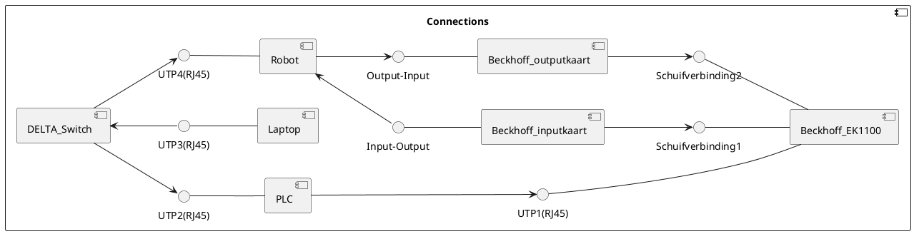
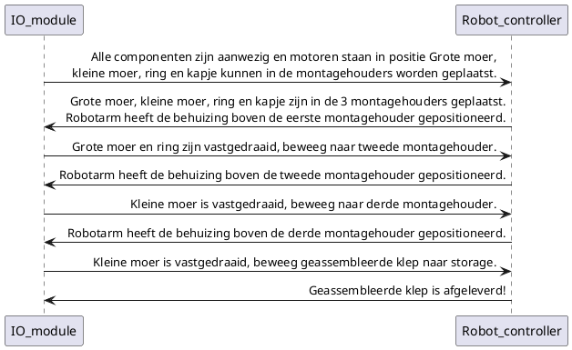
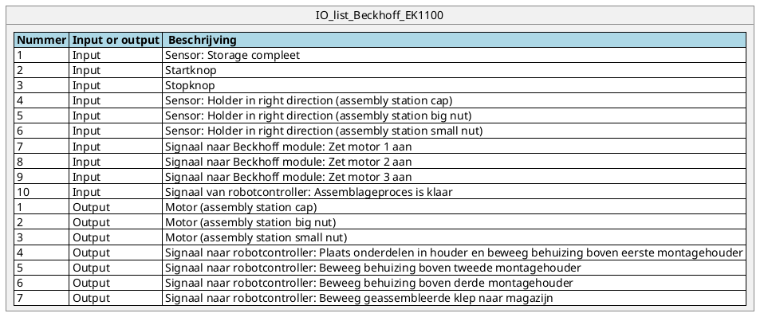

# Connections testplaat

```plantuml
@startuml conncections
skinparam backgroundColor transparent
left to right direction
'skinparam linetype ortho

component Connections {
    
    [Beckhoff_EK1100]
    () "Schuifverbinding1" -- Beckhoff_EK1100
    () "Schuifverbinding2" -- Beckhoff_EK1100
    () "UTP1(RJ45)" -- Beckhoff_EK1100
    
    [PLC]
    () "UTP2(RJ45)" -- PLC
    PLC --> "UTP1(RJ45)"

    [Beckhoff_inputkaart]
    () "Input-Output" -- Beckhoff_inputkaart
    Beckhoff_inputkaart --> "Schuifverbinding1"

    [Beckhoff_outputkaart]
    () "Output-Input" -- Beckhoff_outputkaart
    Beckhoff_outputkaart --> "Schuifverbinding2"

    [DELTA_Switch]
    DELTA_Switch --> "UTP2(RJ45)"
    DELTA_Switch <-- "UTP3(RJ45)"
    DELTA_Switch --> "UTP4(RJ45)"

    [Laptop]
    () "UTP3(RJ45)" -- Laptop

    [Robot]
    () "UTP4(RJ45)" -- Robot
    Robot <-- "Input-Output"
    Robot --> "Output-Input"

}
@enduml
```
Sequence diagram communication between robotcontroller and Beckhoff EK1100 module

```plantuml
@startuml
skinparam sequenceMessageAlign right
IO_module -> Robot_controller : Alle componenten zijn aanwezig en motoren staan in positie Grote moer,\nkleine moer, ring en kapje kunnen in de montagehouders worden geplaatst.
Robot_controller -> IO_module : Grote moer, kleine moer, ring en kapje zijn in de 3 montagehouders geplaatst.\nRobotarm heeft de behuizing boven de eerste montagehouder gepositioneerd.
IO_module -> Robot_controller : Grote moer en ring zijn vastgedraaid, beweeg naar tweede montagehouder.
Robot_controller -> IO_module : Robotarm heeft de behuizing boven de tweede montagehouder gepositioneerd.
IO_module -> Robot_controller : Kleine moer is vastgedraaid, beweeg naar derde montagehouder.
Robot_controller -> IO_module : Robotarm heeft de behuizing boven de derde montagehouder gepositioneerd.
IO_module -> Robot_controller : Kleine moer is vastgedraaid, beweeg geassembleerde klep naar storage.
Robot_controller -> IO_module : Geassembleerde klep is afgeleverd!
@enduml
```

```plantuml
@startuml

object IO_list_Beckhoff_EK1100 {
  <#lightblue,#black>|= Nummer |= Input or output |=  Beschrijving |
  <#white>| 1 | Input | Sensor: Storage compleet |
  <#white>| 2 | Input | Startknop |
  <#white>| 3 | Input | Stopknop |
  <#white>| 4 | Input | Sensor: Holder in right direction (assembly station cap) |
  <#white>| 5 | Input | Sensor: Holder in right direction (assembly station big nut) | 
  <#white>| 6 | Input | Sensor: Holder in right direction (assembly station small nut) |
  <#white>| 7 | Input | Signaal naar Beckhoff module: Zet motor 1 aan |
  <#white>| 8 | Input | Signaal naar Beckhoff module: Zet motor 2 aan |
  <#white>| 9 | Input | Signaal naar Beckhoff module: Zet motor 3 aan |
  <#white>| 10 | Input | Signaal van robotcontroller: Assemblageproces is klaar |  
  <#white>| 1 | Output | Motor (assembly station cap) | 
  <#white>| 2 | Output | Motor (assembly station big nut) |
  <#white>| 3 | Output | Motor (assembly station small nut) |
  <#white>| 4 | Output | Signaal naar robotcontroller: Plaats onderdelen in houder en beweeg behuizing boven eerste montagehouder |
  <#white>| 5 | Output | Signaal naar robotcontroller: Beweeg behuizing boven tweede montagehouder |
  <#white>| 6 | Output | Signaal naar robotcontroller: Beweeg behuizing boven derde montagehouder |
  <#white>| 7 | Output | Signaal naar robotcontroller: Beweeg geassembleerde klep naar magazijn |

}
@endulm
```