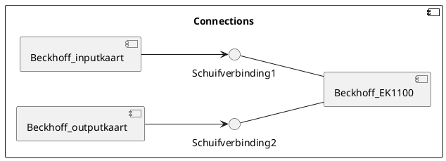

# Connections testplaat

```plantuml
@startuml conncections
skinparam backgroundColor transparent
left to right direction
'skinparam linetype ortho

component Connections {
    
    [Beckhoff_EK1100]
    () "Schuifverbinding1" -- Beckhoff_EK1100
    () "Schuifverbinding2" -- Beckhoff_EK1100
 
    [Beckhoff_inputkaart]
    Beckhoff_inputkaart --> "Schuifverbinding1"

    [Beckhoff_outputkaart]
    Beckhoff_outputkaart --> "Schuifverbinding2"

}

@enduml
```