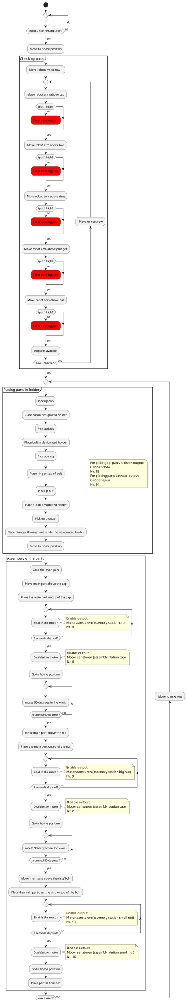

# Flowchart

```plantuml
@startuml

start
repeat
repeat while(input 2 high? (startbutton)) is (no)
-> yes;
:Move to home position;

Partition "Checking parts" {
  :Move robotarm to row 1;
  repeat
    :Move robot arm above cap;
    if (iput 1 high?) then (no)
        #red:Error missing part;
        kill
      endif
    -> yes;
    :Move robot arm above bolt;
    if (iput 1 high?) then (no)
        #red:Error missing part;
        kill
      endif
    -> yes;
    :Move robot arm above ring;
    if (iput 1 high?) then (no)
        #red:Error missing part;
        kill
      endif
    -> yes;
    :Move robot arm above plunger;
    if (iput 1 high?) then (no)
        #red:Error missing part;
        kill
      endif
    -> yes;
    :Move robot arm above nut;
    if (iput 1 high?) then (no)
        #red:Error missing part;
        kill
      endif
    -> yes;
    :All parts availible;
        backward: Move to next row;
  repeat while (row 5 checked?) is (no)
  -> yes;
}
  repeat
Partition "Placing parts in holder"{
  note right
    For picking up parts activate output:
    Gripper close
    Nr. 15
    For placing parts activate output:
    Gripper open
    Nr. 14
  end note
    
  :Pick up cap;
  :Place cap in designated holder;

  :Pick up bolt;
  :Place bolt in designated holder;
  :Pick up ring;
  :Place ring ontop of bolt;

  :Pick up nut;
  :Place nut in designated holder;
  :Pick up plunger;
  :Place plunger through nut inside the designated holder;
  :Move to home position;
}

Partition "Assembely of the part"{
  :Grab the main part;
  :Move main part above the cap;
  :Place the main part ontop of the cap;
  repeat
    :Enable the motor;
    note right
      Enable output:
      Motor aansturen (assembly station cap)
      Nr. 8
    end note
  repeat while (3 seconds elapsed?) is (no)
  -> yes;
  :Disable the motor;
   note right
      disable output:
      Motor aansturen (assembly station cap)
      Nr. 8
    end note
  :Go to home position;

  repeat
    :rotate 90 degrees in the x-axis;
  repeat while (rotateted 90 degrees?) is (no)
  -> yes;
  :Move main part above the nut;
  :Place the main part ontop of the nut;
  repeat
    :Enable the motor;
     note right
      Enable output:
      Motor aansturen (assembly station big nut)
      Nr. 9
    end note
  repeat while (3 seconds elapsed?) is (no)
  -> yes;
  :Disable the motor;
   note right
      Disable output:
      Motor aansturen (assembly station cap)
      Nr. 8
    end note
  :Go to home position;

  repeat
    :rotate 90 degrees in the x-axis;
  repeat while (rotateted 90 degrees?) is (no)
  -> yes;
  :Move main part above the ring/bolt;
  :Place the main part over the ring ontop of the bolt;
   repeat
    :Enable the motor;
     note right
      Enable output:
      Motor aansturen (assembly station small nut)
      Nr. 10
    end note
  repeat while (3 seconds elapsed?) is (no)
  -> yes;
  :Disable the motor;
   note right
      Disable output:
      Motor aansturen (assembly station small nut)
      Nr. 10
    end note
  :Go to home position;
  :Place part in final box;
}
backward: Move to next row;
repeat while (row 5 used?) is (no)
-> yes;
stop


@enduml
```