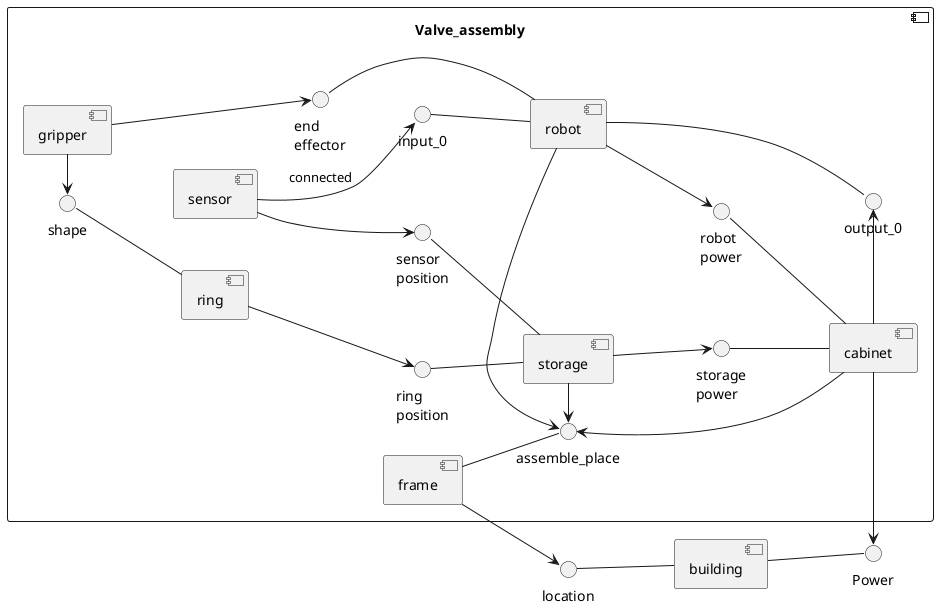
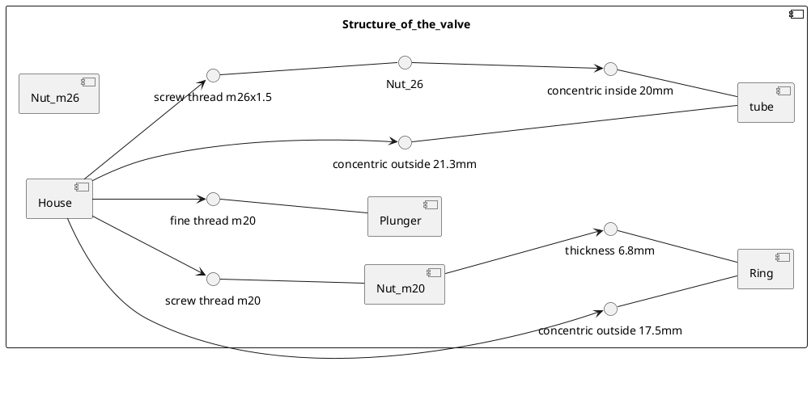

# Introduction

This is the folder for the Process and Safety project. This project is done by Mika Haarhuis, Tim Scholte Lubberink, Matthijs Seinhorst and Timon Kraan.

To give you an idea of our project, a state diagram has been created below:

