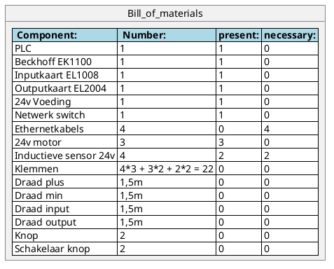

# Bill of materials

```plantuml
@startuml

object Bill_of_materials {
  <#lightblue,#black>|=  Component:  |=  Number:  |= present: |= necessary: |
  <#white>| PLC | 1 | 1 | 0 |
  <#white>| Beckhoff EK1100 | 1 | 1 | 0 |
  <#white>| Inputkaart EL1008 | 1 | 1 | 0 |
  <#white>| Outputkaart EL2004 | 1 | 1 | 0 |
  <#white>| 24v Voeding | 1 | 1 | 0 |
  <#white>| Netwerk switch | 1 | 1 | 0 |
  <#white>| Ethernetkabels | 4 | 0 | 4 | 
  <#white>| 24v motor | 3 | 3 | 0 |
  <#white>| Inductieve sensor 24v | 4 | 2 | 2 |
  <#white>| Klemmen | 4*3 + 3*2 + 2*2 = 22 | 0 | 0 |
  <#white>| Draad plus | 1,5m | 0 | 0 |
  <#white>| Draad min | 1,5m | 0 | 0 |
  <#white>| Draad input | 1,5m | 0 | 0 |
  <#white>| Draad output | 1,5m | 0 | 0 |
  <#white>| Knop | 2 | 0 | 0 |
  <#white>| Schakelaar knop | 2 | 0 | 0 |
}

@endulm
```