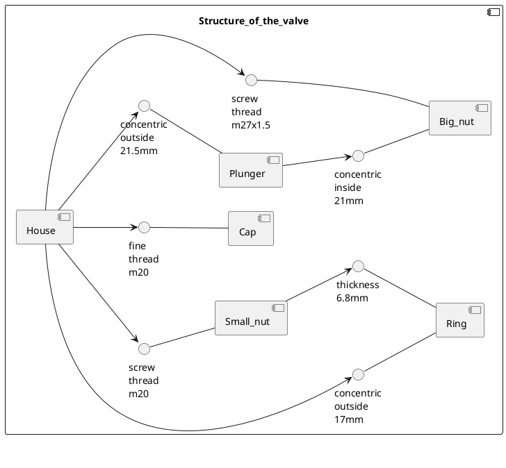
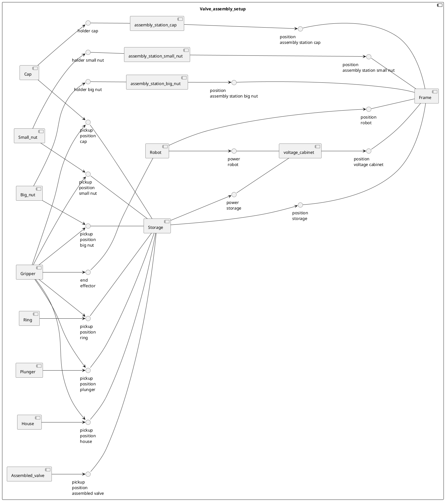
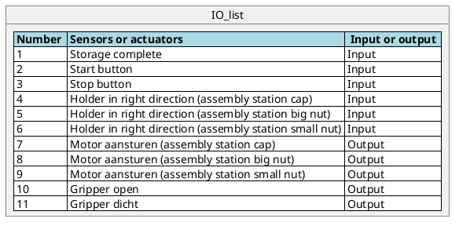

# Structure
This is the folder for the Process and Safety project. This project was carried out by Mika Haarhuis, Tim Scholte Lubberink, Matthijs Seinhorst and Timon Kraan. During the start of the project we wrote two diagrams. These are shown below. The first diagram is a component diagram showing the construction of the valve. All parts are named and it is shown how everything is connected.

Component diagram:

The second diagram shows the setup. All important factors are incorporated and linked together. Based on this diagram, components can be found and the system can be further built up.

Component diagram:

