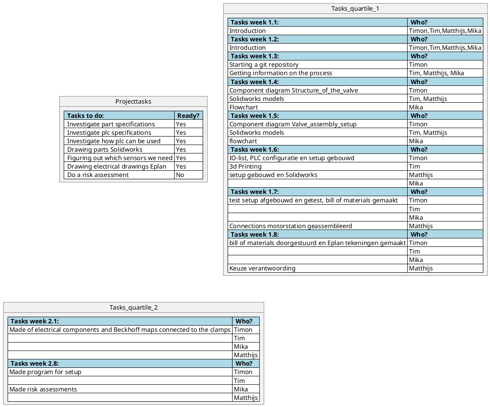

# Tasks

Below are all tasks that must be performed during this project.

```plantuml
@startuml

object Projecttasks {
  <#lightblue,#black>|=  Tasks to do:  |=  Ready?  |
  <#white>|  Investigate part specifications | Yes | 
  <#white>|  Investigate plc specifications | Yes |
  <#white>|  Investigate how plc can be used  | Yes |
  <#white>|  Drawing parts Solidworks | Yes |
  <#white>|  Figuring out which sensors we need | Yes |
  <#white>|  Drawing electrical drawings Eplan | Yes |
  <#white>|  Do a risk assessment | No |
}

object Tasks_quartile_1 {
  <#lightblue,#black>|=  Tasks week 1.1:  |=  Who?  |
  <#white>| Introduction | Timon,Tim,Matthijs,Mika |
  <#lightblue,#black>|=  Tasks week 1.2:  |=  Who?  |
  <#white>| Introduction | Timon,Tim,Matthijs,Mika |
  <#lightblue,#black>|=  Tasks week 1.3:  |=  Who?  |
  <#white>| Starting a git repository | Timon |
  <#white>| Getting information on the process | Tim, Matthijs, Mika |
  <#lightblue,#black>|=  Tasks week 1.4:  |=  Who?  |
  <#white>| Component diagram Structure_of_the_valve | Timon |
  <#white>| Solidworks models| Tim, Matthijs |
  <#white>| Flowchart| Mika |
  <#lightblue,#black>|=  Tasks week 1.5:  |=  Who?  |
  <#white>| Component diagram Valve_assembly_setup | Timon |
  <#white>| Solidworks models| Tim, Matthijs |
  <#white>| flowchart| Mika |
  <#lightblue,#black>|=  Tasks week 1.6:  |=  Who?  |
  <#white>| IO-list, PLC configuratie en setup gebouwd | Timon |
  <#white>| 3d Printing | Tim |
  <#white>| setup gebouwd en Solidworks | Matthijs |
  <#white>|  | Mika |
  <#lightblue,#black>|=  Tasks week 1.7:  |=  Who?  |
  <#white>| test setup afgebouwd en getest, bill of materials gemaakt | Timon |
  <#white>|  | Tim |
  <#white>|  | Mika |
  <#white>| Connections motorstation geassembleerd| Matthijs |
  <#lightblue,#black>|=  Tasks week 1.8:  |=  Who?  |
  <#white>| bill of materials doorgestuurd en Eplan tekeningen gemaakt | Timon |
  <#white>|  | Tim |
  <#white>|  | Mika |
  <#white>| Keuze verantwoording | Matthijs |
}


object Tasks_quartile_2 {
  <#lightblue,#black>|=  Tasks week 2.1:  |=  Who?  |
  <#white>| Made of electrical components and Beckhoff maps connected to the clamps | Timon |
  <#white>|  | Tim |
  <#white>|  | Mika |
  <#white>|  | Matthijs |
    <#lightblue,#black>|=  Tasks week 2.8:  |=  Who?  |
  <#white>| Made program for setup | Timon |
  <#white>|  | Tim |
  <#white>| Made risk assessments | Mika |  
  <#white>|  | Matthijs |
}


@endulm
```