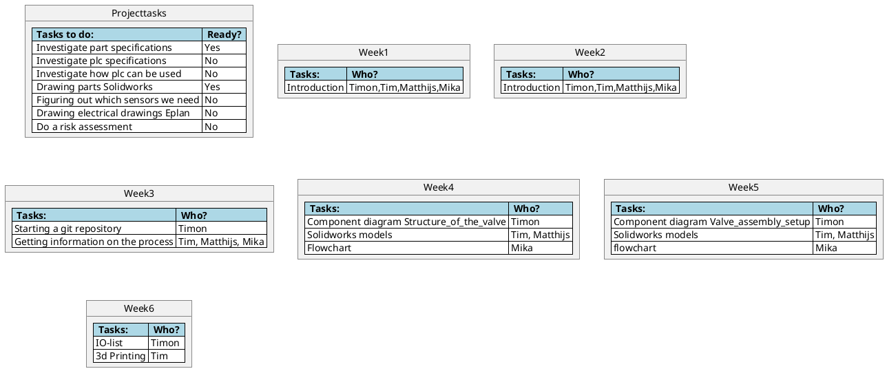

# Tasks

Onderstaand staan alle taken die tijdens dit project uitgevoerd moeten worden.

```plantuml
@startuml

object Projecttasks {
  <#lightblue,#black>|=  Tasks to do:  |=  Ready?  |
  <#white>|  Investigate part specifications | Yes | 
  <#white>|  Investigate plc specifications | No |
  <#white>|  Investigate how plc can be used  | No |
  <#white>|  Drawing parts Solidworks | Yes |
  <#white>|  Figuring out which sensors we need | No |
  <#white>|  Drawing electrical drawings Eplan | No |
  <#white>|  Do a risk assessment | No |
}

object Week1 {
  <#lightblue,#black>|=  Tasks:  |=  Who?  |
  <#white>| Introduction | Timon,Tim,Matthijs,Mika |
}

object Week2 {
  <#lightblue,#black>|=  Tasks:  |=  Who?  |
  <#white>| Introduction | Timon,Tim,Matthijs,Mika |
}

object Week3 {
  <#lightblue,#black>|=  Tasks:  |=  Who?  |
  <#white>| Starting a git repository | Timon |
  <#white>| Getting information on the process | Tim, Matthijs, Mika |
}

object Week4 {
  <#lightblue,#black>|=  Tasks:  |=  Who?  |
  <#white>| Component diagram Structure_of_the_valve | Timon |
  <#white>| Solidworks models| Tim, Matthijs |
  <#white>| Flowchart| Mika |
}

object Week5 {
  <#lightblue,#black>|=  Tasks:  |=  Who?  |
  <#white>| Component diagram Valve_assembly_setup | Timon |
  <#white>| Solidworks models| Tim, Matthijs |
  <#white>| flowchart| Mika |
}

object Week6 {
  <#lightblue,#black>|=  Tasks:  |=  Who?  |
  <#white>| IO-list | Timon |
  <#white>| 3d Printing | Tim |
}

@endulm
```